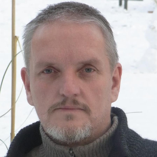

# About the author

  

Adam Art Ananda was born on November 20, 1963 as a Scorpio, a Virgo ascendant with a moon in Capricorn and a lot of Sagittarius energy in Hamburg and grew up in the district Pinneberg. After finishing secondary school, he trained as a machine fitter. When he was torn from the work process by a disease of the spine, which he didn't enjoy anyway, he decided to enroll in the master's school. At the same time, he began a distance learning course to become a mechanical engineer. There was a very long waiting list for the master school and Art dropped out of the technician course after the second semester, as he had already developed his first program during his studies, through which he could earn a lot of money in a short time.
Out of sheer curiosity, Art continued to research in the field of software development and five years later was hired for the first time as a consultant for a large chemical company. Some top 500 companies were then his clients for the next few years until the stock market crash in 2000 finally forced him to give up. After the tax office blocked all his accounts and he had to lift his fingers, he moved to Switzerland. There he worked for a few years for an airline and later for a bank. Art studied graphic design and *human computer interaction design* in Switzerland. He dropped out of the latter in the third semester, as he already knew most of what is taught there from his *graphic design* studies and (at his age) was no longer dependent on a master's degree.  

Art currently works as a tantra masseur, gives sessions in Sexological-Bodywork, supports singles and couples in SlowSex, teaches people in tantra massage and gives various other workshops to help people lead a better, more exciting and fulfilling life.  

He is also committed to implementing the UBUNTU movement. UBUNTU (“I am because we are”) is an idea for a community in which there is neither money nor exchange nor trade. Everyone does what they want and what they are talented for. He gives his time for the good of the community in which he lives. In return he will certainly get what he needs from the community.
Art can often be found in Denmark for kitesurfing, plays the djembe together with a few people in Mauerpark in Berlin, creates communities in Portugal, he drove motocross and racing kart, likes to snowboard and sail catamarans. In addition, he prefers to ride his bike than by car through the city and is constantly trying out new things that he might like.  
He rejects monogamy as well as polyamory, at least if they are lived in closed relationships, for himself and therefore lives as a single according to the principle of poly-anarchy. That means that he is with one or more people in the moment and just enjoying that moment. You're just together until you break up the next day or even after a few days or weeks. Then you may meet with other people or again with the previous ones. Just as everyone likes it.  